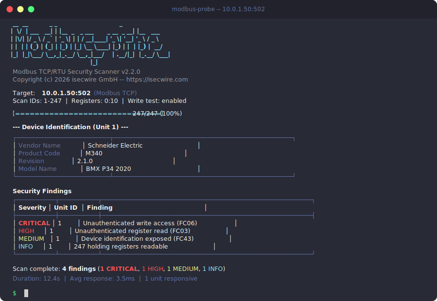

# modbus-probe

[](https://github.com/isecwire/modbus-probe/actions/workflows/ci.yml)
[](LICENSE)
[](https://isocpp.org/)

Modbus TCP/RTU security scanner and auditor for OT/SCADA environments.

`modbus-probe` performs unauthenticated reconnaissance, device fingerprinting, function code fuzzing, and write-access testing against Modbus devices. It implements the Modbus TCP and RTU-over-TCP protocols from scratch using raw sockets -- no external Modbus library dependencies -- giving full control over frame construction and timing for security assessment purposes.



## Features

- **Unit ID enumeration** -- scan all 247 valid Modbus unit IDs to discover responsive devices behind gateways
- **Full function code support** -- FC01 (Read Coils), FC02 (Read Discrete Inputs), FC03 (Read Holding Registers), FC04 (Read Input Registers), FC05 (Write Single Coil), FC06 (Write Single Register), FC15 (Write Multiple Coils), FC16 (Write Multiple Registers), FC43/14 (Read Device Identification)
- **Modbus RTU-over-TCP** -- native support for RTU framing with CRC-16/Modbus (optimized with lookup table), common with serial-to-Ethernet gateways
- **Device fingerprinting** -- extract vendor name, product code, revision, and model via FC43 MEI (Read Device Identification)
- **Function code fuzzing** -- send all function codes 1-127 and report which are supported, with response timing
- **Network discovery** -- scan IP ranges (CIDR notation) for hosts with open Modbus TCP ports using `--discover`
- **Register change monitoring** -- continuously poll registers and alert on value changes with colored diff output using `--monitor`
- **PCAP traffic capture** -- export all Modbus TCP frames to PCAP format for Wireshark analysis with `--pcap`
- **Register range scanning** -- scan large register ranges with automatic chunking (125 registers per request)
- **Unauthorized write testing** -- safely test whether a device accepts unauthenticated write operations (FC06) with automatic rollback to the original value
- **Multi-threaded scanning** -- configurable thread pool for parallel unit ID enumeration
- **Response timing analysis** -- measure and report per-operation latencies for each unit ID
- **Severity classification** -- automatic finding classification (CRITICAL, HIGH, MEDIUM, INFO)
- **Multiple output formats** -- JSON, CSV, and formatted ASCII tables with Unicode box drawing
- **Colored terminal output** -- ANSI-colored status indicators with progress bars
- **Shell completions** -- generate Bash/Zsh completion scripts with `--completions`
- **Zero external dependencies** -- pure C++17 with POSIX sockets and pthreads; builds anywhere with a modern compiler

## Building

```bash
mkdir build && cd build
cmake .. -DCMAKE_BUILD_TYPE=Release
make -j$(nproc)
```

The binary is produced at `build/modbus-probe`.

### Running Tests

```bash
cd build
cmake .. -DCMAKE_BUILD_TYPE=Debug
make -j$(nproc)
./modbus-probe-tests
```

### Requirements

- C++17 compiler (GCC 7+, Clang 5+)
- CMake 3.14+
- Linux/macOS (POSIX sockets + pthreads)

## Usage

```
modbus-probe [options]

Required:
  -H, --host <addr>       Target host (IP or hostname)

Connection:
  -p, --port <port>       Modbus TCP port (default: 502)
  -m, --mode <mode>       Protocol mode: tcp, rtu (default: tcp)
  -t, --timeout <ms>      Response timeout in ms (default: 2000)
      --connect-timeout    Connection timeout in ms (default: 3000)

Scanning:
  -s, --scan-ids <range>  Unit ID range to scan, e.g. 1-247 (default: 1-247)
  -r, --registers <range> Register start and count, e.g. 0:10 (default: 0:10)
  -c, --coils <range>     Coil start and count, e.g. 0:16 (default: 0:16)
      --range <ranges>    Extra register ranges, e.g. 0-100,400-500
  -w, --test-write        Test for unauthorized write access (with rollback)
      --no-device-id      Skip FC43/14 device identification

Fuzzing:
  -f, --fuzz [unit_id]    Fuzz all function codes (1-127) on unit ID

Discovery & Monitoring:
      --discover <CIDR>   Scan IP range for Modbus devices (e.g. 192.168.1.0/24)
      --monitor           Monitor registers for changes (Ctrl+C to stop)

Performance:
  -T, --threads <N>       Number of scanning threads (default: 1)

Output:
  -o, --output <file>     Write report to file
  -F, --format <fmt>      Output format: json, csv, table (default: json)
      --pcap <file>       Capture Modbus traffic to PCAP file
  -q, --quiet             Suppress progress, only emit report data
  -v, --verbose           Verbose output with per-operation details
      --no-color          Disable colored terminal output
      --completions <sh>  Generate shell completions (bash, zsh)
  -h, --help              Show this help message
```

### Examples

Basic scan of a PLC on the default Modbus TCP port:

```bash
modbus-probe --host 192.168.1.100
```

Scan unit IDs 1-10 with write testing, 4 threads, ASCII table output:

```bash
modbus-probe -H 10.0.0.50 -s 1-10 -w -T 4 -F table
```

RTU-over-TCP scan with extended register range:

```bash
modbus-probe -H plc.local -m rtu --range 0-100,400-500
```

Fuzz all function codes on unit ID 1:

```bash
modbus-probe -H 10.0.0.50 --fuzz 1
```

Quick scan with JSON to file:

```bash
modbus-probe -H plc.local -s 1-5 -q -o report.json
```

CSV export for spreadsheet analysis:

```bash
modbus-probe -H 192.168.1.100 -F csv -o findings.csv
```

Scan specific register ranges across multiple units:

```bash
modbus-probe -H 10.0.0.50 -s 1-5 --range 0-99,400-499,1000-1099
```

Verbose scan with device identification disabled:

```bash
modbus-probe -H 192.168.1.100 -v --no-device-id
```

Discover Modbus devices on a /24 subnet:

```bash
modbus-probe --discover 192.168.1.0/24 -T 32
```

Monitor register changes in real time:

```bash
modbus-probe -H 192.168.1.100 -s 1 -r 0:20 --monitor
```

Capture traffic to PCAP while scanning:

```bash
modbus-probe -H 10.0.0.50 -s 1-10 --pcap capture.pcap
```

Generate Bash completions:

```bash
modbus-probe --completions bash > /etc/bash_completion.d/modbus-probe
```

## Output Formats

### JSON (default)

```json
{
  "tool": "modbus-probe",
  "version": "2.2.0",
  "target_host": "192.168.1.100",
  "target_port": 502,
  "protocol_mode": "tcp",
  "scan_start": "2026-04-03T14:30:00.000Z",
  "scan_end": "2026-04-03T14:30:12.345Z",
  "summary": {
    "units_scanned": 247,
    "units_responsive": 3,
    "unauthenticated_reads": 3,
    "unauthenticated_writes": 1,
    "devices_identified": 2,
    "thread_count": 1
  },
  "results": [
    {
      "unit_id": 1,
      "responsive": true,
      "device_identification": {
        "supported": true,
        "vendor": "Schneider Electric",
        "product_code": "M340",
        "revision": "2.1.0"
      },
      "holding_registers": { "readable": true, "count": 10, "data": [...] },
      "input_registers": { "readable": true, "count": 10, "data": [...] },
      "coils": { "readable": true, "count": 16, "data": [...] },
      "write_test": {
        "performed": true,
        "vulnerable": true,
        "detail": "Unauthorized write succeeded and was rolled back (addr=0)"
      },
      "timing": { "samples": 4, "min_ms": 1.20, "avg_ms": 3.50, "max_ms": 8.10 },
      "findings": [
        { "severity": "CRITICAL", "category": "unauthorized_write", "description": "..." },
        { "severity": "HIGH", "category": "unauthorized_read", "description": "..." }
      ]
    }
  ]
}
```

### CSV

One row per unit with columns: `unit_id`, `responsive`, `holding_regs_readable`, `input_regs_readable`, `coils_readable`, `write_tested`, `write_vulnerable`, `severity`, `detail`.

### ASCII Table

Formatted terminal output with Unicode box-drawing characters, colored severity tags, progress bars, and register/coil data tables.

## Architecture

```
src/
  main.cpp              CLI entry point, argument parsing
  modbus_scanner.h/cpp  Core scanner: TCP/RTU I/O, all function codes, multi-threading
  report.h/cpp          Data structures, JSON generation, severity classification
  rtu_framing.h/cpp     RTU frame building with CRC-16/Modbus (lookup table)
  device_id.h/cpp       MEI device identification (FC43/14)
  fuzzer.h/cpp          Function code fuzzer utilities
  progress.h/cpp        Terminal UI: ANSI colors, progress bars, ASCII banner
  table_formatter.h/cpp ASCII table and CSV output formatters
  pcap_writer.h/cpp     PCAP file writer for Modbus traffic capture
  monitor.h/cpp         Register change monitoring with colored diff
  discovery.h/cpp       Network discovery: CIDR scanning for Modbus hosts
tests/
  main_test.cpp         Minimal test framework (no external deps)
  test_modbus_scanner.cpp  Scanner frame building and parsing tests
  test_report.cpp       JSON generation tests
  test_rtu_framing.cpp  CRC-16 and RTU framing tests
  test_device_id.cpp    Device identification parsing tests
  test_pcap_writer.cpp  PCAP file format tests
  test_discovery.cpp    CIDR expansion and IP parsing tests
```

## How It Works

`modbus-probe` implements both Modbus TCP (MBAP header) and RTU-over-TCP (CRC-16) protocols directly over TCP sockets. For each target unit ID, it:

1. Sends a Read Holding Registers request (FC03) as a liveness probe, measuring response latency
2. If the unit responds (even with an exception), performs a full scan:
   - Reads holding registers (FC03), input registers (FC04), and coils (FC01)
   - Scans any additional register ranges specified via `--range`
   - Attempts device identification via FC43/14 (MEI) to extract vendor/product info
3. If `--test-write` is enabled, reads a holding register, writes a modified value (XOR 0x0001), then immediately restores the original value
4. If `--fuzz` is enabled, sends every function code 1-127 and records responses
5. Classifies all findings by severity (CRITICAL/HIGH/MEDIUM/INFO)
6. Aggregates results into the selected output format (JSON/CSV/table)

Multi-threaded mode partitions the unit ID range across worker threads, each with its own TCP connection. Results are merged and sorted by unit ID after all threads complete.

## Legal Disclaimer

This tool is provided for **authorized security testing and auditing only**. Unauthorized access to industrial control systems, SCADA networks, or any computer system is illegal under laws including (but not limited to) the Computer Fraud and Abuse Act (CFAA), the EU Network and Information Security Directive (NIS2), and local criminal codes.

**You must have explicit written authorization from the system owner before using this tool.**

The authors and isecwire GmbH accept no liability for misuse of this software. Use at your own risk and in compliance with all applicable laws and regulations.

## FAQ

### What does "unauthorized write access" mean?

Modbus is a protocol from the 1970s with **zero authentication**. There are no passwords, keys, or tokens. Anyone with network access can send a command like "write value 100 to register 40001" and the PLC executes it. This means an attacker on the OT network can change setpoints — temperature, motor speed, valve position — without any credentials.

modbus-probe tests exactly this: "can I read/write PLC registers from the network without any login?" If yes, that's a critical finding.

### Is there a standard that requires this?

Yes. **IEC 62443** (industrial cybersecurity standard) requires access control for industrial control systems. The **EU NIS2 Directive** requires operators of critical infrastructure to assess and mitigate OT risks. modbus-probe helps identify these gaps.

### How is this used in practice?

You arrive at a client's factory, connect to their OT network (with authorization), run `modbus-probe --host 10.0.1.50 --scan-ids --test-write`, and get a JSON report showing which PLCs allow unauthenticated read/write. This goes into the pentest report with severity ratings.

## License

MIT License. See [LICENSE](LICENSE) for details.

Copyright (c) 2026 isecwire GmbH
